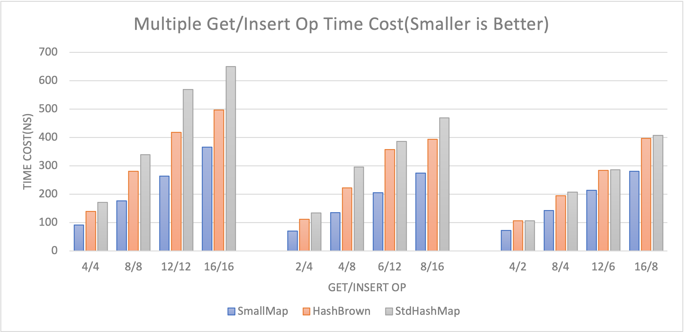

# Small-Map
[](https://crates.io/crates/small-map)

An inline SIMD accelerated hashmap designed for small amount of data.

## Usage
```rust
use small_map::SmallMap;
// Don't worry about the 16 here.
// When the size grows, it will automatically switch to heap impl.
type MySmallMap<K, V> = SmallMap<16, K, V>;

let mut map = MySmallMap::new();
map.insert(1_u8, 2_u8);
assert_eq!(*map.get(&1).unwrap(), 2);
```
Usually you can use this map for short lifetime and small key/values, for example, http or RPC headers.

You can use it like other normal hashmaps without worrying about its size.

## Performance
The performance of SmallMap depends on the capacity, Key/Value size and operation scenario.

It is recommended to set the size to 16(or 32) because with SSE2 it can search 16 items within a single instruction. It is only recommended to use SmallMap for small Key/Values, such as numbers and strings.



Here is a benchmark result with size 16 and u8 key/value. This benchmark was conducted on an Intel Xeon.

> [!NOTE]
> Comparing to HashBrown, it saves 25%~43% CPU in test scenario; and comparing to std HashMap, it saves 25%~54% CPU in test scenario.

## How it Works
Like SmallVec, for HashMap with a small amount of data, inlining the data can avoid heap allocation overhead and improve performance.

SmallMap inlines a fixed-size sequential structure, and refers to the design of swisstable to additionally store the hash of the data in Group units, and uses SIMD to accelerate the search.

When the data capacity exceeds the inline capacity, the data will be transferred to HashMap implemented by hashbrown.

## Credit
[Hashbrown](https://crates.io/crates/hashbrown) is heavily referenced to and copied by this project, and is a very elegant and efficient implementation.